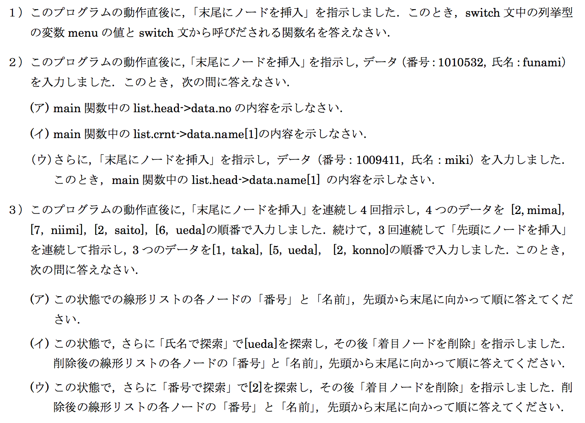

# 授業中練習問題8

ソースコード：[source.c](./source.c)



## 提出

```
1) menu = 1, ScanMember, InsertRear

2)
(ア) 1010532
(イ) u
(ウ) u

3)
(ア) [2,konno],[5,ueda],[1,taka],[2,mima],[7,niimi],[2,saito],[6,ueda]
(イ) [2,konno],[1,taka],[2,mima],[7,niimi],[2,saito],[6,ueda]
(ウ) [5,ueda],[1,taka],[2,mima],[7,niimi],[2,saito],[6,ueda]
```